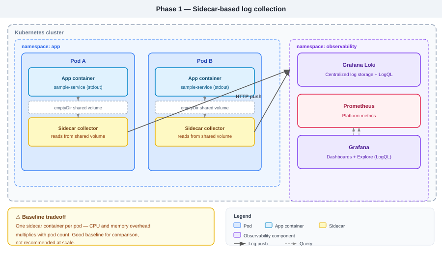
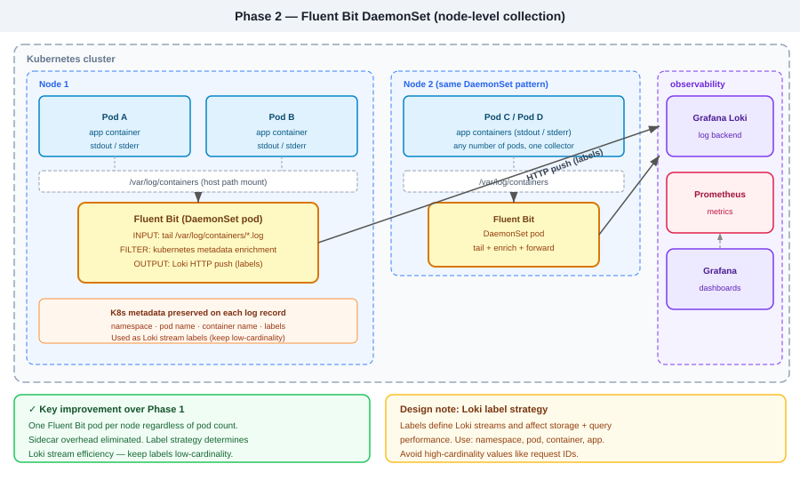
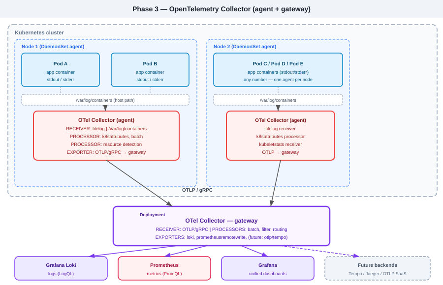

# Centralized Logging Platform

> An architecture journey from **sidecar-based log collection** → **Fluent Bit DaemonSet** → **OpenTelemetry Collector**, with a stable **Grafana Loki + Grafana** backend throughout.

This project documents the decisions, trade-offs, and operational differences across three collection patterns on Kubernetes. Each phase is runnable independently — deploy Phase 1 to understand the baseline, then migrate to see the operational delta firsthand.

---

## Architecture phases

### Phase 1 — Sidecar-based collection (baseline)



Each Pod carries a dedicated sidecar container that reads from a shared `emptyDir` volume and pushes logs to Loki. This establishes a baseline for comparison — it works, but every new Pod brings another sidecar, making resource overhead proportional to pod count.

```
k8s/sidecar/
├── sample-service-with-sidecar.yaml   # Pod spec: app + collector containers, emptyDir
```

---

### Phase 2 — Fluent Bit DaemonSet (node-level collection)



A single Fluent Bit pod runs on every node via DaemonSet. It tails `/var/log/containers` on the host path, enriches each record with Kubernetes metadata (namespace, pod, container, labels), and pushes to Loki using label-based streams.

**Key design decisions:**
- Loki labels should remain **low-cardinality** — namespace, pod, container, app are good; request IDs or timestamps are not. Labels define streams and directly affect storage and query performance.
- Kubernetes metadata enrichment must be preserved through the Fluent Bit `kubernetes` filter so logs stay searchable by namespace and pod context.

```
k8s/fluent-bit/
├── daemonset.yaml      # One Fluent Bit pod per node
├── configmap.yaml      # INPUT/FILTER/OUTPUT pipeline
└── rbac.yaml           # ClusterRole to read pod metadata
```

---

### Phase 3 — OpenTelemetry Collector (agent + gateway)



OTel Collector replaces Fluent Bit with an **agent-to-gateway** pattern:

- **Agent** (DaemonSet): Uses the `filelog` receiver to read container logs per node, `k8sattributes` processor for metadata enrichment, and exports via OTLP/gRPC to the gateway. Also collects node metrics via `kubeletstats` receiver.
- **Gateway** (Deployment): Fans in all agent traffic, applies batch and routing processors, and exports to Loki, Prometheus, and any future backends (Tempo, Jaeger, OTLP SaaS).

> **Note:** The `filelog` receiver is more configuration-heavy than Fluent Bit. Multiline handling, JSON parsing, and attribute mapping require explicit config where Fluent Bit handles these more concisely.

```
k8s/otel/
├── agent-daemonset.yaml    # OTel Collector DaemonSet
├── gateway-deployment.yaml # OTel Collector gateway
├── agent-config.yaml       # filelog + k8sattributes + OTLP exporter
└── gateway-config.yaml     # OTLP receiver + Loki/Prom exporters
```

---

## Stack

| Layer | Technology | Role |
|---|---|---|
| Platform | Kubernetes | Runtime for Pods, DaemonSets, Deployments |
| Baseline collection | Sidecar collector | Phase 1 — per-pod, emptyDir pattern |
| Node-level collection | Fluent Bit | Phase 2 — DaemonSet, host path tail |
| Evolution path | OpenTelemetry Collector | Phase 3 — filelog receiver, agent-to-gateway |
| Log backend | Grafana Loki | Centralized log storage, LogQL query |
| Dashboards | Grafana | Log search, Explore, dashboards |
| Metrics | Prometheus | Platform and pod metrics |
| Diagrams | SVG + Mermaid | Diagrams as code |

---

## Quick start

```bash
# 1. Deploy observability backend
kubectl apply -f k8s/loki/
kubectl apply -f k8s/grafana/
kubectl apply -f k8s/prometheus/

# 2. Phase 1 — sidecar baseline
kubectl apply -f k8s/sidecar/

# 3. Phase 2 — migrate to Fluent Bit
kubectl delete -f k8s/sidecar/
kubectl apply -f k8s/fluent-bit/

# 4. Phase 3 — optional OTel migration
kubectl apply -f k8s/otel/
```

---

## Key design notes

**Loki label strategy matters.** Labels define streams — high-cardinality values (user IDs, request IDs) create one stream per unique value and degrade performance. Stick to: `namespace`, `pod`, `container`, `app`, `env`.

**Fluent Bit vs OTel filelog.** Fluent Bit is simpler for straightforward Kubernetes log collection. OTel filelog handles any telemetry signal but requires more explicit config. See [`docs/migration-fluentbit-to-otel.md`](./docs/migration-fluentbit-to-otel.md) for the config mapping.

**Set Loki retention on day one.** Without it, disk usage grows unbounded. Configure per-stream retention in `limits_config` based on namespace or environment label.

---

See [`architecture/blueprint.md`](./architecture/blueprint.md) for full ADRs covering the Loki vs Elasticsearch decision, sidecar vs DaemonSet trade-offs, and the OTel migration rationale.

---

<div align="center">

**[Pradeep Kapa](https://linkedin.com/in/pradeepkapa)** · Senior Cloud Engineer  
[LinkedIn](https://linkedin.com/in/pradeepkapa) · [GitHub](https://github.com/pradeep-kapa)

</div>
