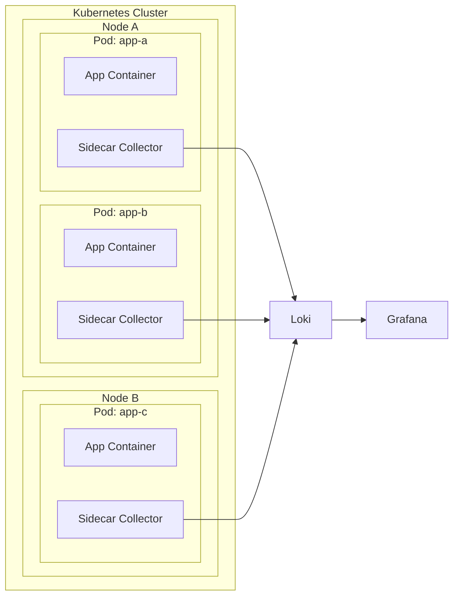

# Baseline sidecar architecture

```mermaid
flowchart LR
    subgraph K8s[Kubernetes Cluster]
        subgraph N1[Node A]
            subgraph P1[Pod: app-a]
                A1[App Container]
                S1[Sidecar Collector]
            end
            subgraph P2[Pod: app-b]
                A2[App Container]
                S2[Sidecar Collector]
            end
        end
        subgraph N2[Node B]
            subgraph P3[Pod: app-c]
                A3[App Container]
                S3[Sidecar Collector]
            end
        end
    end
    S1 --> L[Loki]
    S2 --> L
    S3 --> L
    L --> G[Grafana]
```
