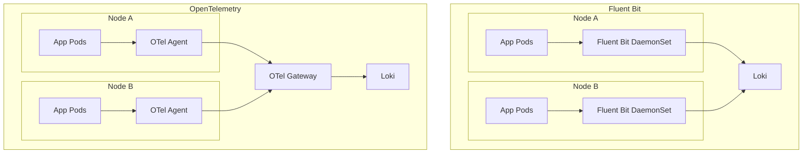

# Fluent Bit to OpenTelemetry evolution

The OpenTelemetry Collector filelog receiver is the de facto way to collect Kubernetes file-based logs, and the Collector supports official agent-to-gateway deployment patterns for more scalable telemetry pipelines.[web:419][web:444]

