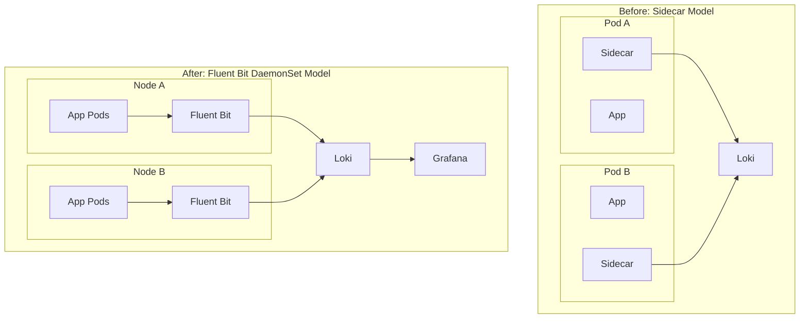

# Sidecar to Fluent Bit migration

Fluent Bit is commonly deployed on Kubernetes as a DaemonSet, which makes it a natural replacement for per-Pod sidecar collection when the goal is cluster-wide node-level logging.[web:486][web:487]

