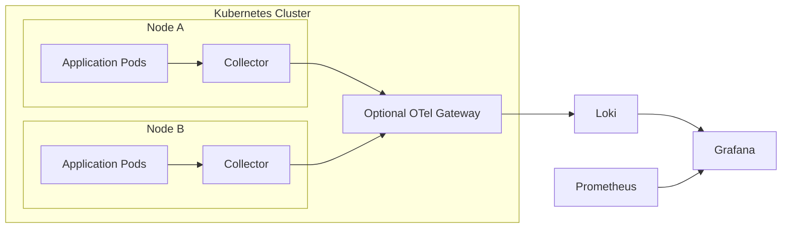

# Target-state architecture

```mermaid
flowchart LR
    subgraph K8s[Kubernetes Cluster]
        subgraph N1[Node A]
            A1[Application Pods]
            C1[Collector]
            A1 --> C1
        end
        subgraph N2[Node B]
            A2[Application Pods]
            C2[Collector]
            A2 --> C2
        end
        GW[Optional OTel Gateway]
    end
    C1 --> GW
    C2 --> GW
    GW --> L[Loki]
    L --> G[Grafana]
    P[Prometheus] --> G
```
